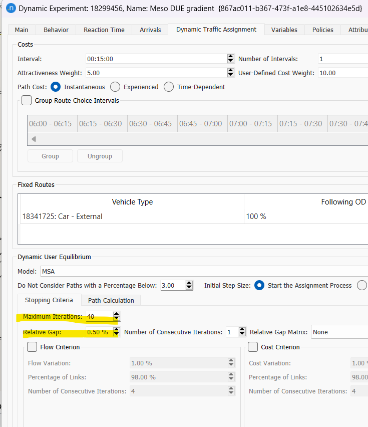

# Repo Contents
## ui.py tools for analyzing Aimsum results.
To use:
* pip install -r requirements.txt
* streamlit run ui.py

## Aimsum script tools
Used within Aimsum to add various capabilites
### demo_aimsum_script
Shows the basic aimsum script
### BuildMatrixFromPreDay.py
Import matrix from external pre day data (from SimMobility)

## Aimsum running framework
Used to run aimsum progrematically, possibly invoking custom script tools. 
*Incomplete*

# Software Installation

# Aimsum Installation
## License
Apply for a license on Aimsum’s [form](https://www.aimsun.com/academic/student-edition/).

## Installation
After installing Aimsum, and Aimsum licenser:

Open Aimsum licenser; c:\progam files\Aimsum\Licenser\Aimsum Licenser
Sign in with provided username and password, and ‘Acquire’ a license.

## Troubleshooting
If you receive ‘Cannot connect to server’ when running the licenser, try using another network, Free-TAU is blocking the server.

## Installing Script Dependencies
Follow this [guide](https://docs.aimsun.com/next/22.0.1/UsersManual/ScriptIntro.html#:~:text=Always%20choose%20the%20most%20recent%20version%20of%20Python%203%20available.) to install required python dependencies like pandas, and numpy.

### What worked for me:
- Get the python version of Aimsum’ python interpreter:
    - Create a new script in Aimsum
    ```
    import sys
    print(sys.version)
    ```
- Download python for windows with the same major version - for Aimsum with python 3.10.5, install the latest python 3.10 (Currently 3.10.11).
- Install required libraries using cmd:
    ```
    pip install pandas
    ```
- Go to windows system properties
- Set environment variable PYTHONPATH to these folders (change to your <username>, and separate folders with “;” ):
    ```
C:\Users\<username>\AppData\Local\Programs\Python\Python310\lib;C:\Users\<username>\AppData\Local\Programs\Python\Python310\lib\site-packages;
    ```
- Restart Aimsum, and verify you can import the libs correctly.


## Installing SQLITE3/Workaround
When trying to import sqlite3 in Aimsum python scripts, I got this error:

    "DLL load failed while importing _sqlite3: The specified procedure could not be found."

To fix this, download SQLite3.dll 64bit from [Sqlite Website](https://www.sqlite.org/download.html).
Backup the original dll from
```
C:\Program Files\Aimsun\Aimsun Next 23
```
And then replace the dll with the new one. The problem is probably due to different version in new python environment installation and original sqlite3 version supplied by Aimsum, Hopefuly this workaround does not create new issues down the road.

# Simulation Setup
## Base case files
https://www.dropbox.com/personal/Base_Case_November

Base_case_november.ang - aimsum file,

Base_case_november.sqlite - aimsum output results (configured for sqlite output)

Demand/November_base_case - simmobility output DAS

Demand/November_base_case_aggregate - simmobility output DAS with region renaming to match Tel aviv region names - use this file as input DAS for aimsum

## Demand Details
Regarding Demand/November_base_case_aggregate:
- person_id - is the original personid with “_1” suffix
- stop_mode - ignore non ‘Car’ modes
- arrival_time and departure_time - the times as converged to in simmobility
- prev_stop_departure_time - the actual departure time for the tour to be used in Aimsum
- prev_stop_zone - source centroid
- stop_zone - target centroid

# Aimsum simulation file
## Experiment setup
Scenarios/Network

Define outputs, including the option to store vehicle trajectories.
Scenarios/Network/Meso DUE gradient


## Demand data
Car - intercity OD matrices generated from simmobility

car_External - intracity demand data from cellular survey which is taken as it is and not generated with simulated intercity demand data.

## Generating OD matrices
Under scripts/Build matrix with preday loop - takes as input the DAS files, and creates/updated the OD matrices.
The script is documented in the wiki, and is equivalent to the before run script.
External dependencies:
- Id.csv
- SortByMode…py

## Add OD Matrices to Demand
Under Traffic Demands\Das Demand add the relevant matrices, and possibly set a Factor to dilute matrices for quick runs. 0.01% Takes a few minutes to complete.

## Scenario
### Convergence Criteria
Under Scenarios/Network/Meso DUE gradient, in the Dyamic traffic assignment tab, the equilibrium condition is defined - 40 iterations or 0.5 gap 

### Incremental Scenario
To speed up convergence, the scenario is set up to incrementally add vehicles and fill the network, under Scenarios/Network/Meso DUE gradient/100%; 3 incremental iterations are defined. Each should converge using the convergence criteria, and only the last iteration is the convergeed 100% scenario.


## Run sequence
- Generate OD Matrices by running BuildMatrixFromPreDayExternal
- Add matrices to Demand data (Traffice demands\ Das Demand) 

# Map Changelog
- 24/7/24 After run 18401625 noticed that there is a missing lane at section 17454967, added the lane to the turn, and there was not alocated phase for this turn at the control plan. Added a phase without increasing overall cycle.
- 24/7/24 Connecting centroid 18402713 south into neighborhod to avoid no route warning.


# Status

## BUGS


# Links
[Future mobility lab github](https://github.com/futuremobilitylabTAU)

[TMG Toolbox](https://tmg.utoronto.ca/doc/1.6/tmgtoolbox_aimsun/index.html)
